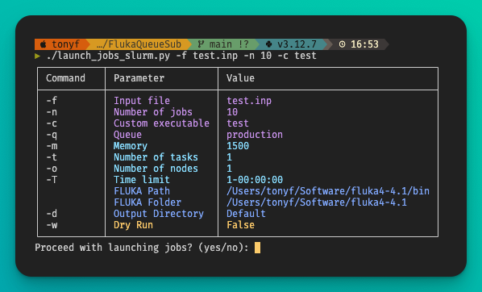

# Fluka Queue Submission Scripts

This repository contains scripts to launch FLUKA jobs using different queue systems: SLURM and HTCondor.

<p align="center">
    
</p>

## Scripts

1. `launch_jobs_slurm.py`
    - This script can be used to launch jobs using the SLURM queue.
2. `launch_jobs_htcondor.py`
    - This script can be used to launch jobs using the HTCondor queue.

## Prerequisites

- Python 3.x
- FLUKA installed and configured
- Required Python packages: `argparse`, `os`, `random`, `subprocess`, `logging`, `colorama`, `tabulate`, `string`, `htcondor` (for HTCondor script)

## Installation

1. Clone the repository:
    ```sh
    git clone <repository_url>
    cd <repository_directory>
    ```

2. Install the required Python packages:
    ```sh
    pip install colorama tabulate htcondor
    ```

3. Make the scripts executable:
    ```sh
    chmod +x launch_jobs_slurm.py
    chmod +x launch_jobs_htcondor.py
    ```

## Usage

### SLURM Queue

To launch jobs using the SLURM queue, use the `launch_jobs_slurm.py` script:

```sh
./launch_jobs_slurm.py -f input.inp -n 10 -c custom_exe -q queue -m 1500 -t 1 -o 1 -T 1-00:00:00
```

### HTCondor Queue

To launch jobs using the HTCondor queue, use the `launch_jobs_htcondor.py` script:

```sh
./launch_jobs_htcondor.py -f input.inp -n 10 -c custom_exe -q queue -m 1500 -t 1 -o 1 -T 1-00:00:00
```

### Dry Run

To perform a dry run without submitting jobs, add the `-w` or `--dry-run` flag:

```sh
./launch_jobs_slurm.py -f input.inp -n 10 -c custom_exe -q queue -m 1500 -t 1 -o 1 -T 1-00:00:00 -w
./launch_jobs_htcondor.py -f input.inp -n 10 -c custom_exe -q queue -m 1500 -t 1 -o 1 -T 1-00:00:00 -w
```

### Parameters

- `-f`: Input file for the FLUKA job.
- `-n`: Number of jobs to launch.
- `-c`: Custom executable to use.
- `-q`: Queue to submit the jobs to.
- `-m`: Memory required for each job (in MB).
- `-t`: Number of threads to use.
- `-o`: Output option.
- `-T`: Time limit for the job (format: days-hours:minutes:seconds).

### Output

After the simulations end, the output files will be located in the specified output directory (or the default directory if not specified). The directory structure will be as follows:

- The input file name (without the `.inp` extension) will be used as the base directory name.
- Inside the base directory, there will be subdirectories for each job, named `job_0001`, `job_0002`, etc.
- Each job subdirectory will contain the following files:
  - `*.out`: Standard output of the job.
  - `*.err`: Standard error of the job.
  - `*.log`: Log file of the job (HTCondor only).
  - `*.root`: Output files generated by FLUKA (optional, depending on the custom executable).

Example directory structure:
```
input_file_name/
├── job_0001/
│   ├── job_0001.out
│   ├── job_0001.err
│   ├── job_0001.log (HTCondor only)
│   └── *.root (optional)
├── job_0002/
│   ├── job_0002.out
│   ├── job_0002.err
│   ├── job_0002.log (HTCondor only)
│   └── *.root (optional)
...
```

**This README was generated using AI (GitHub Copilot).