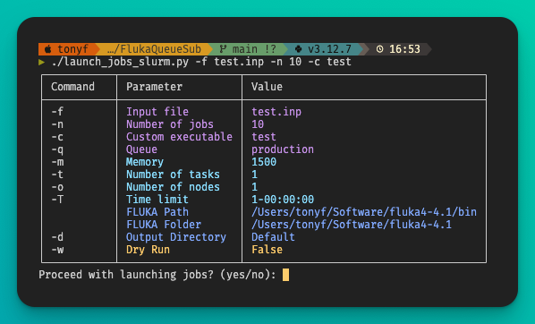

# FLUKA Queue Submission

Launch many independent FLUKA jobs across different batch systems — **SLURM**, **LSF**,
**HTCondor**, and **Task Spooler (TS)** — from a single unified CLI. Each job gets a
distinct random seed, so the runs are statistically independent and safe to combine.

<p align="center">
    
</p>

## Tools

| Script | Purpose |
|--------|---------|
| `launch_jobs.py`    | Generate per-job inputs (unique seeds) and submit them to a backend. |
| `collect_results.py`| Gather each job's `.root` output into a `root_files/` directory. |
| `check_seeds.py`    | Audit job directories for duplicate `RANDOMIZ` seeds. |

## Prerequisites

- Python 3.10+ (uses `X | None` type syntax).
- FLUKA installed and configured — `fluka-config` must be on `PATH` (used to locate
  `rfluka` and the FLUKA data folder).
- The client tool for your backend on `PATH`:
  - `sbatch` — SLURM
  - `bsub` — LSF
  - `condor_submit` + the `htcondor` Python bindings — HTCondor
  - `ts` — Task Spooler
- Your FLUKA input file must contain a `RANDOMIZ` card — the launcher rewrites its
  seed per job. (A `START` card is required only if you override the primary count
  with `-N`.)

## Installation

```sh
git clone <repository_url>
cd FlukaQueueSub
python -m venv .venv && source .venv/bin/activate   # optional
pip install -r requirements.txt
```

`requirements.txt` installs `pyyaml`, `colorama`, `tabulate`, and `rich`. The
HTCondor Python bindings (`htcondor`) are only needed for the `condor` backend and
are typically provided by the cluster environment.

## Usage

`launch_jobs.py` supports four invocation modes.

### 1. Direct subcommand (full CLI)

```sh
python launch_jobs.py <BACKEND> -f sim.inp -n 10 [options]
```

`<BACKEND>` is one of `slurm`, `lsf`, `condor`, `ts`. Examples:

```sh
python launch_jobs.py slurm  -f sim.inp -n 5  -T 2-00:00:00
python launch_jobs.py condor -f sim.inp -n 20 -m 2000
python launch_jobs.py ts     -f sim.inp -n 4
```

Per-backend options:

```sh
python launch_jobs.py slurm  -h
python launch_jobs.py condor -h
```

### 2. Single YAML config

```sh
python launch_jobs.py config.yaml
python launch_jobs.py JobConfigs/test_slurm.yaml
```

### 3. Folder of YAML configs (launched in sequence)

```sh
python launch_jobs.py JobConfigs/
```

### 4. Benchmark mode (predefined profiles)

```sh
python launch_jobs.py benchmark quick     config.yaml
python launch_jobs.py benchmark extensive JobConfigs/
```

- `quick` — 2 jobs, 100 primaries, submitted to the `benchmark_priority_queue` from
  the config (required for this profile).
- `extensive` — 5 jobs, 1000 primaries, queue unchanged from the config.

> The priority-queue override applies to SLURM and LSF only; HTCondor and TS ignore it.

## Common options

These apply to every backend subcommand:

| Flag | Name | Description |
|------|------|-------------|
| `-f` | `--input`      | FLUKA input file (must end in `.inp`). |
| `-n` | `--njobs`      | Number of independent jobs (one random seed each). |
| `-c` | `--custom-exe` | Path to a custom FLUKA executable (passed as `-e` to `rfluka`). Defaults to FLUKA's standard executable. |
| `-d` | `--output-dir` | Root directory for the job subfolders (default: input name without `.inp`). |
| `-N` | `--nprim`      | Primary particles per job — overwrites the `START` card. Omit to keep the value in the `.inp`. |
| `-w` | `--dry-run`    | Build the scripts and print the commands without submitting. |

## Backend-specific options

**SLURM** (`slurm`)

| Flag | Default | Description |
|------|---------|-------------|
| `-q` `--queue`  | `production` | SLURM partition. |
| `-m` `--mem`    | `1500`       | Memory per node (MB). |
| `-t` `--ntasks` | `1`          | Tasks per job (`--ntasks`). |
| `-o` `--nodes`  | `1`          | Nodes per job (`--nodes`). |
| `-T` `--time`   | `1-00:00:00` | Time limit `D-HH:MM:SS`, max `4-00:00:00`. |
| `-g` `--gres`   | `disk:1G`    | Generic resources (`--gres`), e.g. `gpu:1`. |

**LSF** (`lsf`)

| Flag | Default | Description |
|------|---------|-------------|
| `-q` `--queue`  | `production` | LSF queue. |
| `-m` `--mem`    | `1500`       | Memory limit (MB). |
| `-t` `--ntasks` | `1`          | Slots per job (`-n`). |
| `-T` `--time`   | `1-00:00:00` | Time limit `D-HH:MM:SS`, max `4-00:00:00`. |

**HTCondor** (`condor`)

| Flag | Default | Description |
|------|---------|-------------|
| `-q` `--queue`        | `vanilla` | HTCondor universe. |
| `-m` `--mem`          | `1500`    | `request_memory` (MB). |
| `-t` `--ncpu`         | `1`       | `request_cpus`. |
| `-o` `--disk`         | `100000`  | `request_disk` (kB). |
| `-T` `--time`         | `86400`   | `+MaxRuntime` (s), max `345600` (4 days). |
| `--transfer-files`    | `yes`     | `should_transfer_files`. |
| `--output` / `--error` / `--log` | `job_$(Cluster)_$(Process).{out,err,log}` | File name patterns. |

**Task Spooler** (`ts`) — no extra options; uses the common flags only.

## YAML config format

A YAML config holds the same keys as the CLI flags. Minimal SLURM example:

```yaml
backend: slurm
input: /path/to/sim.inp
njobs: 5
nprim: 10000                 # optional
custom_exe: /path/to/myexe   # optional
queue: production
mem: "1500"
ntasks: 1
nodes: 1
time: "1-00:00:00"
gres: "disk:1G"
benchmark_priority_queue: priority   # optional, required for `benchmark quick`
```

See `JobConfigs/` for working examples.

## Dry run

Add `-w` / `--dry-run` to any subcommand to build the scripts and print the commands
without submitting:

```sh
python launch_jobs.py slurm -f sim.inp -n 10 -T 1-00:00:00 -w
```

## Output layout

Jobs are written under the output directory (default: the input name without `.inp`):

```text
sim/
├── job_0001/
│   ├── sim_0001.inp        # per-job input, unique RANDOMIZ seed
│   ├── *.out               # FLUKA stdout
│   ├── *.err               # FLUKA stderr
│   ├── *.log               # HTCondor only
│   └── *.root              # FLUKA output (depends on the executable)
├── job_0002/
│   └── ...
└── ...
```

## Collecting results

After the jobs finish, gather every job's `.root` files into a single
`root_files/` directory per parent run. From the directory that contains the run
folders:

```sh
python collect_results.py
```

It prints a table of the planned moves, asks for confirmation, then moves the
`.root` files and removes the emptied `job_*` directories. Jobs with no `.root`
file are flagged.

## Checking seeds

Each job is made statistically independent by a distinct `RANDOMIZ` seed.
`launch_jobs.py` guarantees uniqueness at generation — including across re-launches
into the same output directory. To audit an existing set of runs (older batches,
manually edited inputs, overlapping launches):

```sh
python check_seeds.py
```

Run from the directory containing the run folders. It scans every `*/job_*/*.inp`,
reports any duplicate seeds in a table, and exits non-zero when duplicates are
found — so it can be used as a gate in scripts or CI.
